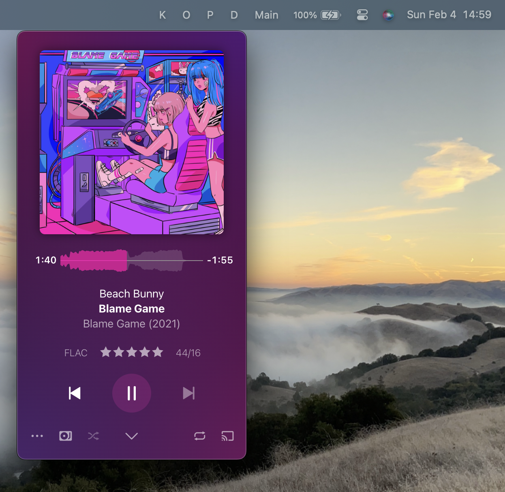

# MenuBarApps.spoon
MenuBarApps is a plugin for Hammerspoon which allows you to make macOS applications behave like Menu Bar items.

As an example, this configuration creates a Menu Bar item with the letter "P" which will automatically hide and show the "Plexamp" application when clicked:



The application will be automatically moved to the focused space in Mission Control. It can either be clicked out of like normal or hidden by clicking the Menu Bar icon again.

You can also use this to create menus and sub-menus of applications as well.

# Known Issues

* Currently does not handle applications that are not open or are minimzed
* In "move" mode it does not end up exactly under the Menu Bar item, particularly when there are several defined

# Installation

This Spoon depends on another Spoon being installed and loaded, [WindowCache](https://github.com/adammillerio/WindowCache.spoon).

## Automated

MenuBarApps can be automatically installed from my [Spoon Repository](https://github.com/adammillerio/Spoons) via [SpoonInstall](https://www.hammerspoon.org/Spoons/SpoonInstall.html). See the repository README or the SpoonInstall docs for more information.

Example `init.lua` configuration which configures `SpoonInstall` and uses it to install and start WindowCache and MenuBarApps:

```lua
hs.loadSpoon("SpoonInstall")

spoon.SpoonInstall.repos.adammillerio = {
    url = "https://github.com/adammillerio/Spoons",
    desc = "adammillerio Personal Spoon repository",
    branch = "main"
}

spoon.SpoonInstall:andUse("WindowCache", {repo = "adammillerio", start = true})

spoon.SpoonInstall:andUse("MenuBarApps", {
    config = {
        apps = {
            {title = "P", app = "Plexamp", action = "move"},
            {title = "D", app = "Discord", action = "maximize"},
            {
                title = "A",
                action = "menu",
                menu = {
                    {title = "KeePassXC", app = "KeePassXC", action = "move"},
                    {title = "Reminders", app = "Reminders", action = "move"}, {
                        title = "Misc",
                        action = "menu",
                        menu = {
                            {
                                title = "Settings",
                                app = "Settings",
                                action = "move"
                            }
                        }
                    }
                }
            }
        }
    },
    start = true
})
```

This will create three menu bar items:

* Menu Bar with icon "P" which opens the "Plexamp" application and moves it to be under the Menu Bar in the current Space
* Menu Bar with icon "D" which opens the "Discord" application and maximizes it in the current Space
* Menu Bar with icon "A" which opens menu with "KeePassXC", "Reminders", and a "Test" sub-menu with "Settings".

These can then be moved around like any other menu bar items.

## Manual

Download the latest WindowCache release from [here.](https://github.com/adammillerio/Spoons/raw/main/Spoons/MenuBarApps.spoon.zip)

Download the latest MenuBarApps release from [here.](https://github.com/adammillerio/Spoons/raw/main/Spoons/MenuBarApps.spoon.zip)

Unzip both and either double click to load the Spoons or place the contents manually in `~/.hammerspoon/Spoons`

Then load the Spoons in `~/.hammerspoon/init.lua`:

```lua
hs.loadSpoon("WindowCache")

hs.spoons.use("WindowCache", {start = true})

hs.loadSpoon("MenuBarApps")

hs.spoons.use("MenuBarApps", {
    config = {
        apps = {
            {title = "P", app = "Plexamp", action = "move"},
            {title = "D", app = "Discord", action = "maximize"},
            {
                title = "A",
                action = "menu",
                menu = {
                    {title = "KeePassXC", app = "KeePassXC", action = "move"},
                    {title = "Reminders", app = "Reminders", action = "move"}, {
                        title = "Misc",
                        action = "menu",
                        menu = {
                            {
                                title = "Settings",
                                app = "Settings",
                                action = "move"
                            }
                        }
                    }
                }
            }
        },
        start = true
    }
})
```

